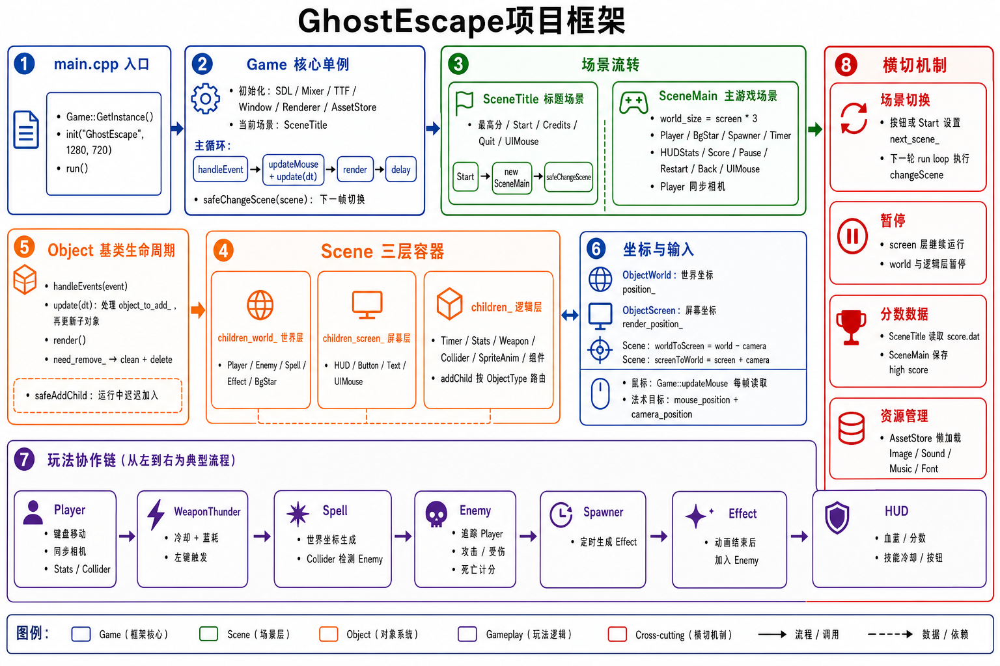
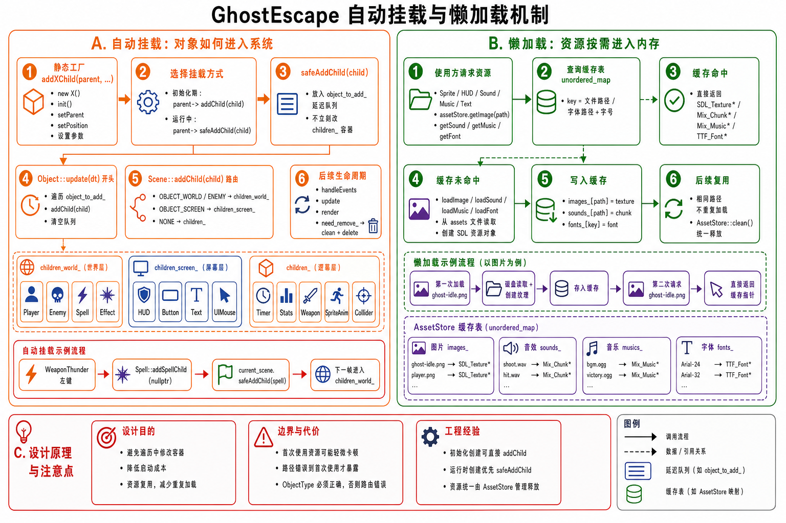

# GhostEscape

一个 2D 俯视角生存游戏，使用 SDL3 和 C++17 开发。玩家操控幽灵角色，使用雷电武器对抗追击的敌人。

## 原作者

Ziyu Shen

本项目代码来自 Ziyu Shen 的 C++ 游戏开发课程练习，仅作学习用途，未做实质性修改。

## 技术栈

- C++17、CMake 3.10+、MSVC
- SDL3、SDL3_image、SDL3_mixer、SDL3_ttf
- glm

## 构建

```bash
cmake -B build -S .
cmake --build build
```

构建产物输出到项目根目录。

## 项目概述




